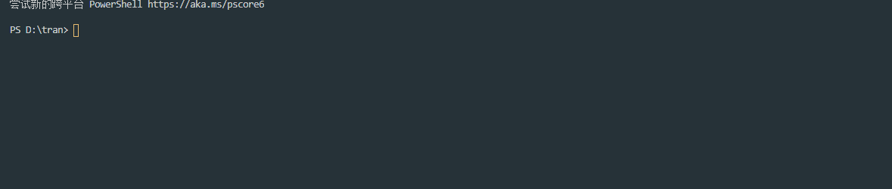

# 安装

```
npm install yd-translation

```

一个结合了有道翻译的命令行工具,暂时只支持英汉互译

目前可能有一些 bug 哈哈 🤣

# 使用:

运行 yd 单词 就可以了

```
PS D:\tran> yd name
name
n.名称，名字；姓名；名誉vt.命名，任命；指定；称呼；提名；叫出adj.姓名的；据以取名的abbr.(NAmE)北美英语(NorthAmericanEnglish)n.(Name)内姆（人名）；（日）滑（姓）

```


